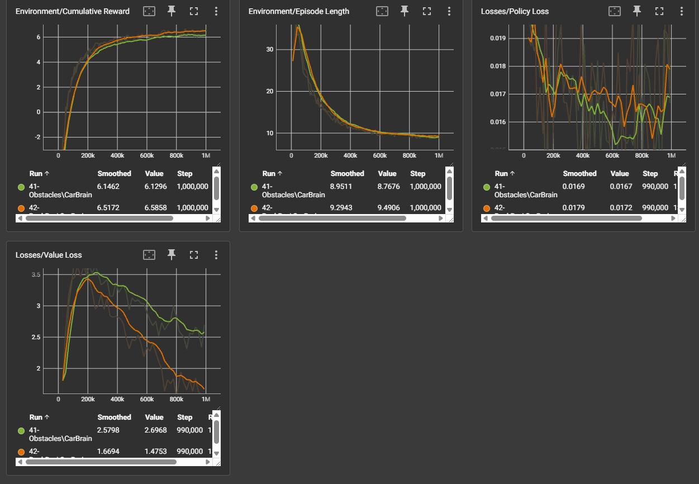

# ppo-car-unity

<video controls>
  <source src="doc/mlss.mp4" type="video/mp4">
</video>

## Overview
This is a tech demo for Reinforcement Learning on unity to move a car to the goal.

### Setup
- Use Unity 6000.0.44f1 or later
- Open Assets/Scenes/Game.unity
- Run

### How to run Reinforcement Learning on it
```cmd
python -m venv .venv
.venv\scripts\activate
pip3 install torch torchvision torchaudio --index-url https://download.pytorch.org/whl/cu121
pip install mlagents
```

- tweak as you want
- in the Game scene, TrainingArea > Free Racing Car > Behaviour Parameters
  - Modified Component > Revert
- (optional: check the bahavior by changing "Behavior Type" to "Heuristic Only" and play. if it's okay, revert it back)
- Make all TrainingArea active (for faster learning)
- Build (on Builds/XXX)
- edit `learn.bat` to specify your build
- run `learn.bat`
- after finished, import generated .onnx file and attach it to Free Racing Car > Behavior Parameters > Model
- (optional: change Behacior Type to "Inference Only" to make sure it's not start learning)

### Tensorboard
- run this on another cmd window
```cmd
tensorboard --logdir results
```

example output:


- 🟢 backward raycast off
- 🟠 backward raycast on

### Remarks
- check `Edit > Project Settings > Player > Settings for Windows, Mac, Linux > Resolution and Presentation > Resolution > Run in Background` or your agent stops when you focus away


### troubleshooting
```
Library\PackageCache\com.unity.ml-agents@2b4ded88494d\Runtime\Grpc\CommunicatorObjects\AgentAction.cs(9,21): error CS0400: The type or namespace name 'Google' could not be found in the global namespace (are you missing an assembly reference?)
```
- Close the editor, remove Library folder, and then try again

## Lisence
MIT.
